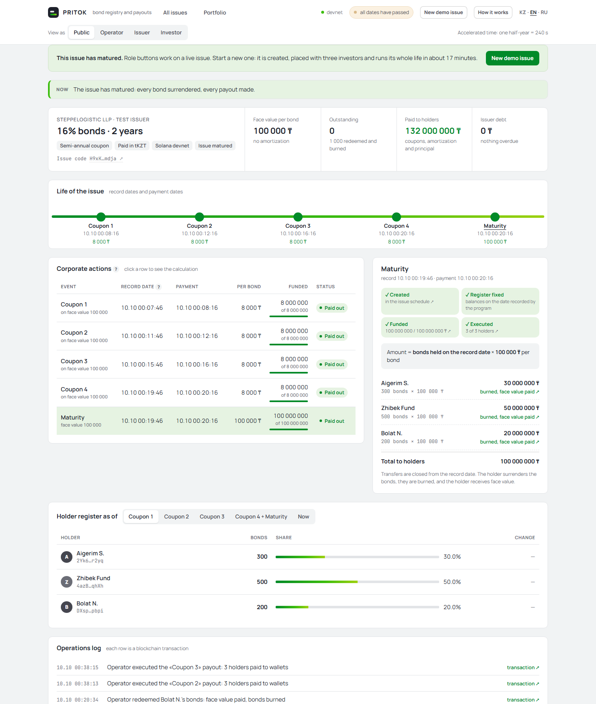
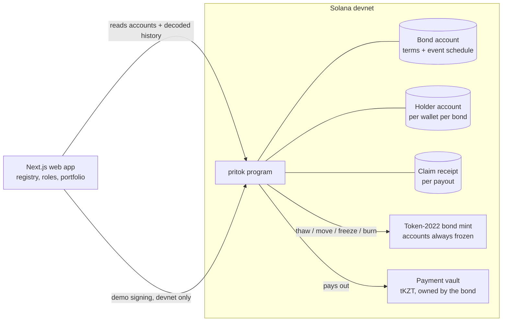
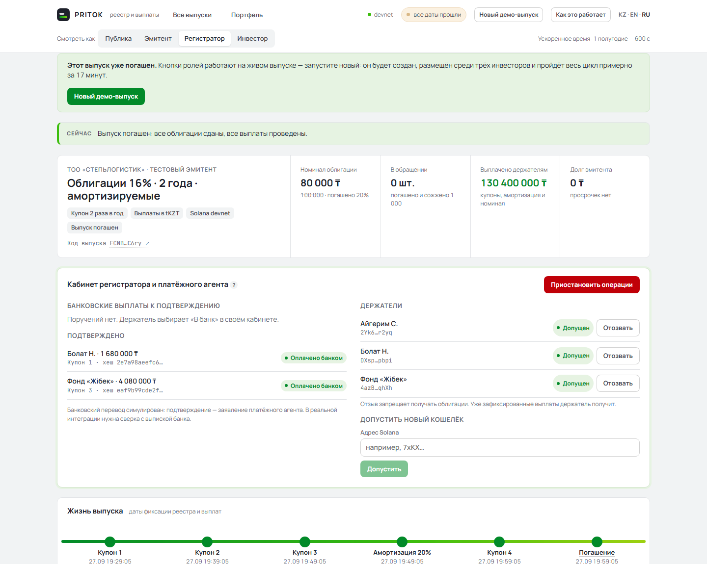
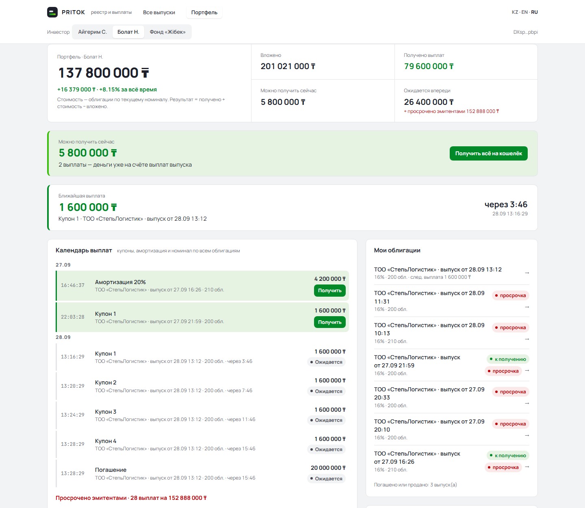
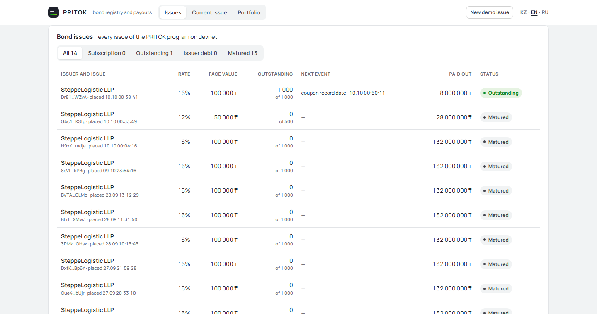

# PRITOK

**Bond registry and payouts on Solana.** *Pritok* is Russian for "inflow": coupons and principal flowing to bondholders on schedule.

PRITOK services a tokenized bond after placement — the job of a registrar and a paying agent. It knows who held the bond on each record date, calculates what every holder is owed, pays it onchain or routes it to a bank, retires the bonds at maturity, and shows publicly when an issuer has not paid. Every entitlement and every payment can be checked in the Solana explorer.

Built for the Superteam Kazakhstan × KASE side track [*Corporate Actions on Blockchain*](https://superteam.fun/earn/listing/superteam-kazakhstan-x-kase-side-track-corporate-actions-on-blockchain). Independent prototype, not affiliated with KASE.

| | |
|---|---|
| **Live demo** | **https://pritok-sol.vercel.app** — Solana devnet, role screens with one-click demo signing |
| Program | [`9LMSMqD3xMBaNdfRb4bKDT3MBTX8ry1Na84rMSJ787aY`](https://explorer.solana.com/address/9LMSMqD3xMBaNdfRb4bKDT3MBTX8ry1Na84rMSJ787aY?cluster=devnet) on devnet |
| Full lifecycle on devnet | [`FCNB…C6ry`](https://pritok-sol.vercel.app/bond/FCNBFwobxkZw7k7n5U3KsRjzR1VSTtXiAD13FsvQC6ry) — coupons, 20% amortization, a default and its cure, wallet and bank payouts, redemption with burn |
| Tests | 19 passing: 7 unit, 12 integration on LiteSVM |



## Try it in three minutes

1. Open **https://pritok-sol.vercel.app** and press **New demo issue**. The interface is in English by default; **KZ · EN · RU** in the header switches to Kazakh or Russian (or add `?lang=kk|en|ru` to a link). In about 10 seconds a bond is created, three investors are admitted, and 1 000 bonds of 100 000 ₸ at 16% are placed among them. Time is accelerated: one half-year lasts four minutes, so the whole two-year issue plays out in about 17 minutes.
2. Follow the **Now** bar at the top. It reads the bond's state and offers the next step with a button that switches to the right role.
3. **Investor**: transfer or sell bonds before the record date and watch the coupon follow the bond. Sell at a clean price and see the accrued interest the program adds.
4. **Issuer**: fund a coupon, or fund only 75% to trigger a public default, then pay the rest to cure it. Declare a partial redemption on a future coupon date.
5. **Investor**: claim a payout to the wallet, or choose **To bank**.
6. **Registrar** (registrar and paying agent): confirm the bank transfer with a payment reference.
7. At maturity the investor redeems: the bonds are burned, and principal plus the last coupon are paid in one transaction.
8. **Portfolio** shows the investor's side across all issues: invested, received, what is due now, a payout calendar.

**How it works** replays a 9-step tour of the screen. A **?** next to a term explains it in plain language.

## Coverage of the track requirements

| Requirement | How PRITOK does it | Where to see it |
|---|---|---|
| Test tokenized instrument with holder registry | Token-2022 bond mint, one holder record per wallet per bond, admission by the registrar | Registry at date, registrar screen |
| **Coupon payment**: holders on the record date | Record-date balances frozen onchain at every balance change (see [record dates](#record-dates)) | *Holder register as of* |
| Coupon: calculate each investor's entitlement | `units at record date × coupon per bond`, per holder | Calculation panel of any event |
| Coupon: execute onchain or show a settlement flow | Both: stablecoin to the wallet, or to a paying agent with bank confirmation | Investor and registrar screens |
| **Redemption**: identify holders, principal due | Transfers close at the maturity record date; principal on the current face after amortization | Maturity event |
| Redemption: settle and retire tokens | `redeem` burns the bonds and pays principal + last coupon atomically | "N redeemed and burned", journal |
| One additional corporate action | **Partial redemption** (amortization), plus secondary **DvP trade** with accrued interest and **default & cure** | Issuer screen, sale form |
| Verifiable onchain record | Receipt account per payout, every operation decoded in the journal with an explorer link | Journal, "to wallet ↗" receipt links |
| Clear line between implemented and simulated | [Table below](#implemented-vs-simulated) | — |

## Architecture



| Component | Role |
|---|---|
| `programs/pritok` | Anchor program: 16 instructions, all corporate-action logic and money movement |
| Token-2022 bond mint | `DefaultAccountState = Frozen`; mint and freeze authority is the bond PDA |
| tKZT | Test tenge (classic SPL token, 2 decimals) used for placement, payouts and trades |
| `web/` | Next.js: public registry, issuer / investor / registrar screens, all-issues list, portfolio. Reads accounts and decodes the program's transaction history server-side |
| `client/` | TypeScript client shared with the web app, and a scripted end-to-end devnet scenario |

### Accounts

| Account | Seeds | Holds |
|---|---|---|
| `Config` | `["config"]` | registrar (operator), pause flag, allowed payment tokens |
| `Bond` | `["bond", issuer, bond_id]` | terms, current face factor, `issued_units`, `supply`, reserved obligations, up to 8 events sorted by record date |
| Bond mint | `["mint", bond]` | Token-2022 mint, 0 decimals |
| Payment vault | ATA of the bond PDA | funded, not yet claimed obligations |
| `Holder` | `["holder", bond, wallet]` | admission flag, balance, record-date balances |
| `Claim` | `["claim", bond, action_id, wallet]` | one payout: units, amount, wallet / bank requested / bank confirmed, payment-reference hash |

### Instructions

| Who | Instructions |
|---|---|
| Registrar | `init_config`, `allow_holder`, `revoke_holder`, `set_paused`, `confirm_bank_payment` |
| Issuer | `create_bond`, `fund_action`, `declare_partial_redemption` |
| Holder | `subscribe`, `transfer_bond`, `trade_dvp` (with the counterparty), `claim`, `claim_to_bank`, `redeem` |
| Anyone | `close_subscription`, `mark_default` |

## Record dates

A Solana program cannot iterate over token holders, and an offchain snapshot is not verifiable. PRITOK records balances lazily instead.

- The bond keeps its events **sorted by record date**; each event has a stable `action_id` and a position in that order.
- **Before any change of a holder's balance** — subscription, transfer, trade, redemption — the program writes the holder's current balance into a slot for every record date that has passed since the holder's last change.
- The holder's entitlement for the event at position *i* is that slot if it was written, otherwise the current balance: nothing has changed since the record date.

Example from the demo: Aigerim holds 300, Bolat 200, the fund 500. Aigerim sends 10 to Bolat **before** coupon 1's record date, and Bolat sends 10 to the fund **after** it. Coupon 1 is paid on 290 / 210 / 500; coupon 2 on 290 / 200 / 510.

Rules that keep this correct, each covered by a test:

- An ad-hoc event (partial redemption) can only be inserted with a record date in the future, so no holder has recorded a slot at or after its position yet.
- Units used for every entitlement are fixed when the subscription closes (`issued_units`); later burns do not shrink what is owed.
- Transfers and trades are closed from the maturity record date, so the right to principal and the token to burn stay with the same holder.
- Bond token accounts are always frozen: a holder cannot move, burn, delegate or re-assign bonds directly through Token-2022. Every attempt fails with `AccountFrozen`.

## Entitlements

| Event | Per bond | Required from the issuer |
|---|---|---|
| Coupon | `face × factor × coupon_rate / 2`; the factor is the one in force for the whole coupon period | `per bond × issued_units` |
| Partial redemption | `face × redeemed share` | funded in full when declared |
| Maturity | `face × current factor` | `per bond × issued_units` |
| Accrued interest (trade) | `next coupon × elapsed share of the period`; zero between the record and payment dates | paid by the buyer |

Amounts are rounded down per holder; any dust stays in the vault. The issuer never withdraws from the vault.

### Kazakhstan conventions

| Convention | Kazakhstan practice | PRITOK |
|---|---|---|
| Record date | Art. 31(2) of the Law "On the Securities Market": holders are fixed as of the start of the last day of the period the payment is for; older issues may keep a longer window set in their terms | `record_offset_secs` is set per issue: one day for a real issue, longer where the prospectus says so. The demo stretches it to 30 seconds out of a 240-second "half-year", so a transfer after the record date can be shown |
| Coupon amount | Day-count basis 30/360 is standard on KASE | A semi-annual coupon is `face × rate / 2`, which is what 30/360 gives for a full regular period |
| Accrued interest | 30/360 | Linear in actual time within the coupon period. Close to 30/360, but not identical around month ends. A 30/360 calendar for real-dated issues is on the roadmap |
| Rounding | Tiyn | Amounts are held in tiyn (2 decimals) and rounded down per holder |

## Settlement flows

- **Wallet payout.** After the payment date a holder claims; the vault pays the tKZT and a receipt account is created. A second claim fails because the receipt already exists.
- **Bank payout.** The holder (or the registrar for a holder without a wallet) chooses the bank: the holder's share moves from the vault to the paying agent onchain, and the receipt is marked *bank requested*. After the bank transfer the paying agent confirms it; only a SHA-256 of the payment reference is stored. A payout goes to the wallet or to the bank, once.
- **Default and cure.** If an event is underfunded on its payment date, anyone can mark it defaulted and the debt is public. Claims stay closed until the issuer pays the full amount; the debt is never written down.
- **Secondary trade (DvP).** Seller and buyer sign one transaction: bonds to the buyer and money to the seller, atomically. The parties set the clean price as a share of the outstanding face; the program adds accrued interest and enforces the buyer's maximum total. The trade is logged as a `TradeSettled` event.
- **Redemption.** At maturity the holder redeems: the bonds are burned, principal is paid, and the last coupon too if it is funded and not yet claimed. Otherwise that coupon stays claimable from the record-date balance.

The vault invariant `vault balance ≥ funded and unclaimed obligations` is checked after every money movement.

## Roles and rights

| Role | Can | Cannot |
|---|---|---|
| Issuer | create the bond, fund events, declare partial redemptions | change terms or the schedule alone, touch the registry, withdraw from the vault |
| Registrar / paying agent | admit and revoke holders, pause subscriptions and transfers, confirm bank payouts | issue bonds, move investors' money |
| Holder | subscribe, transfer, trade, claim to the wallet or the bank, redeem | change anything about the bond |
| Anyone | mark an underfunded event as defaulted, read everything | — |

Revocation and pause never cancel a payout that already exists: a revoked or paused holder still receives recorded coupons and principal.

## Implemented vs simulated

| Implemented onchain | Simulated |
|---|---|
| Bond token, holder registry, admission and revocation, pause | KYC: the registrar simply admits an address |
| Record dates, entitlements, coupons, partial redemption, maturity with burn | tKZT instead of a real tenge stablecoin; the payment token is a parameter, so KZTE or another stablecoin replaces it without code changes |
| Default, public issuer debt and cure | Accelerated time: a "half-year" is minutes |
| Bank payout up to the paying agent, confirmation with a payment-reference hash | The bank transfer itself: the confirmation is the paying agent's statement |
| DvP trade with program-computed accrued interest | Price discovery: the parties agree the clean price; there is no order book |
| — | Demo signing: the web server signs with devnet demo keys; in production each party signs on its own device or through a broker or custodian |

## Screens

| | |
|---|---|
|  |  |
| Registrar: bank payouts confirmed with reference hashes, admission, pause | Investor portfolio: result, payouts due now, next payout, calendar, holdings |



## Testing and review

- **19 tests** (`cargo test -p pritok`). Integration tests run the compiled program on LiteSVM with a controllable clock:
  - direct Token-2022 bypasses fail with `AccountFrozen`;
  - transfer before and after a record date;
  - skipped record dates;
  - partial redemption inserted after holders have synced;
  - transfer lock at the maturity record date;
  - double claim;
  - default and cure;
  - redemption before the last coupon is funded;
  - recreation of a closed empty token account;
  - bank payout and confirmation;
  - revocation and pause;
  - DvP with accrued interest, ex-coupon, buyer limit and pause.
- **Two rounds of independent design review** before the code was written (see `docs/REVIEW-BRIEF.md` and `docs/PLAN.md`). The first round replaced a transfer hook with always-frozen accounts after finding bypasses via owner burn and `SetAuthority`. The second fixed amortization timing, fixed `issued_units`, restricted payment mints and added the vault reserve.
- Complete lifecycles run on devnet: three bonds from placement to redemption, one of them entirely through the web app's action API.

## Limitations and next steps

- **Admission is per bond.** In a real market an investor passes KYC once. Next step: an investor registry shared across issues.
- **Bank confirmation is an attestation.** A production integration needs reconciliation with the paying agent's bank statement.
- **At most 8 events per bond:** 4 coupons, maturity and up to 3 partial redemptions.
- Next: KZTE or another tenge stablecoin as the payment token, coupons per year as an issue parameter (today semi-annual), 30/360 accrued interest on real dates, bondholder voting, a yield-to-maturity display.

## Build and run

Anchor 0.32.1, Agave 3.1.12, Rust 1.89.

```bash
anchor build
cargo test -p pritok
```

On Windows, `scripts/wsl-test.sh` builds and tests in the WSL filesystem, which is much faster than `/mnt/c`.

Web app:

```bash
cd web && npm install
cp .env.example .env.local   # RPC_URL: a dedicated devnet RPC; DEMO_SIGNING=1 for the role buttons
npm run dev                  # http://localhost:3100
```

With `DEMO_SIGNING=1` the server signs with devnet demo keys: locally from `client/.keys`, on a host such as Vercel from `DEMO_KEYS` (JSON of secret-key byte arrays; Root Directory `web`). Anyone with the link can press the buttons, so use it on devnet only. The public devnet RPC rate-limits the registry reads; use a dedicated endpoint such as Helius.

Scripted scenarios:

```bash
cd client && npm install
npm run scenario                  # full lifecycle, about 11 minutes
MODE=setup npm run scenario       # create and place a bond, continue from the UI
../scripts/drive-sandbox.sh <bond> # drive a setup bond to maturity through the web API
```

## Repository

```
programs/pritok/     Anchor program and LiteSVM tests
client/              TypeScript client and the devnet scenario
web/                 Next.js app: registry, role screens, issues list, portfolio
docs/PLAN.md         plan, design decisions and status (Russian)
docs/REVIEW-BRIEF.md brief used for the independent design review
scripts/             WSL build and test, sandbox driver
```

## Кратко по-русски

PRITOK — реестр держателей и платёжный агент для токенизированных облигаций на Solana.
- **Дата фиксации:** программа сама запоминает балансы держателей, без снимков вне блокчейна.
- **Выплаты:** права считаются по каждому держателю. Купоны и номинал идут на кошелёк в стейблкоине или через банк с подтверждением платёжного агента.
- **Дефолт** эмитента виден всем и не списывается.
- **Погашение:** облигации сжигаются, держатель получает номинал.
- **Вторичный рынок:** сделка «поставка против оплаты», НКД считает программа.

Демо: https://pritok-sol.vercel.app. Нажмите «Новый демо-выпуск» и следуйте подсказке «Сейчас».
