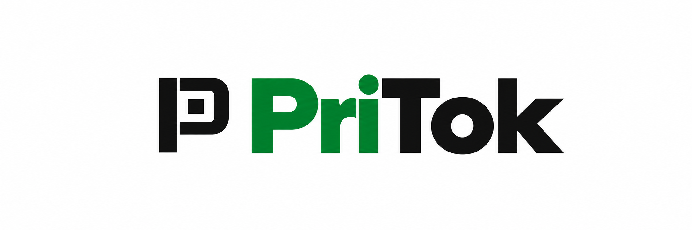

# PriTok — логотип

Выбранный и доработанный вариант от 10 октября 2026 года.

- Название: **PriTok**.
- Смысл названия: **PRIncipal + TOKens**.
- Отдельный стилизованный знак P — чёрный, с квадратом токена внутри.
- В названии Pri — зелёное, Tok — чёрное; фон белый.
- Знак уменьшен до высоты заглавных букв и выровнен с названием.
- Расшифровка и слоган в логотипе отсутствуют.

Файл: [assets/pritok-logo-polished.png](assets/pritok-logo-polished.png).

PNG создан с помощью ImageGen. В заливке остаётся небольшая тональная
неоднородность.
